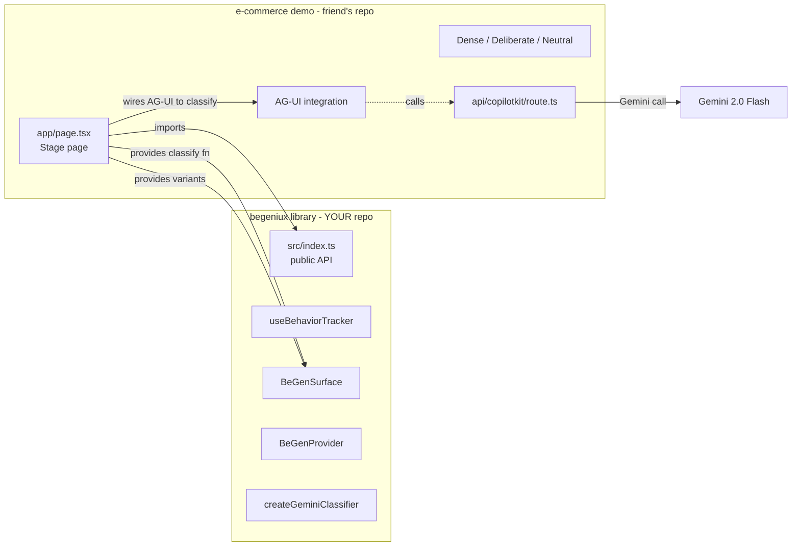
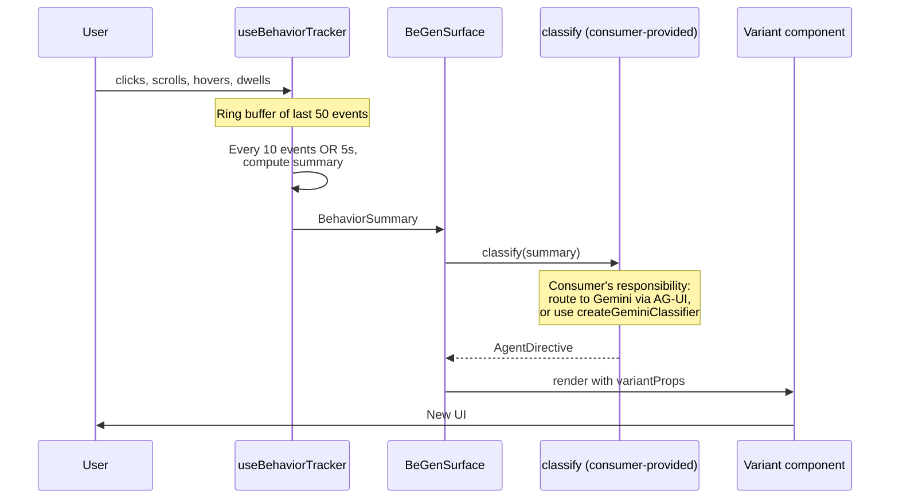

# BeGeniux — Library Build Spec

> **Audience:** Claude Code, building the `begeniux` library (this repo) — npm-installable, framework-agnostic on the agent backend.
> **Companion repo:** the e-commerce demo lives separately, forked from the [CopilotKit Generative UI Global Hackathon Starter Kit](https://github.com/redesyef/Generative-UI-Global-Hackathon-Starter-Kit-begeniux), and is being built by a teammate. **This spec is only about the library.** Do not build a Next.js app, do not build product grids, do not build a stage page — those belong in the consumer repo.
> **Build window:** 6 hours. Submit by 6 PM local.
> **Stack:** TypeScript + React (peer dep) + tsup (build). The library does NOT depend on Next.js or CopilotKit at the package level — it accepts the classifier as an injection.

---

## 0. What we're building

`begeniux` is an **npm-installable React library** that makes any web app behaviorally adaptive: the consumer wraps a region of UI in `<BeGenSurface>`, passes in a set of variant components and a `classify` function, and the library handles behavior tracking, summarization, and variant swapping in real time.

The library is intentionally **agnostic to the LLM/agent backend.** The consumer wires up their own `classify` function — typically against CopilotKit / AG-UI / Gemini for the hackathon, but it could be Claude, OpenAI, a local model, or even a hand-coded heuristic. The library exposes a small `createGeminiClassifier()` utility for consumers who don't want to wire up AG-UI themselves, but the core abstraction is the contract, not the integration.

The teammate's e-commerce demo will:
1. `npm install begeniux` (or install from this repo's git URL during the hackathon — see §6)
2. Wire up an AG-UI route to Gemini
3. Pass that route as the `classify` function to `<BeGenSurface>`
4. Watch the library re-render product grids based on shopper behavior

### Thesis (use verbatim in the README)

> Most generative UI today reacts to *prompts*. BeGeniux reacts to *behavioral traces*. Our contribution is the combination of three ideas that have not been combined before: interaction traces as the input modality (not text prompts), LLM agents as the policy (not hand-coded rules or shallow classifiers), and session-granularity adaptation (not population-level A/B tests) — under developer-declared invariants that keep the policy honest. The first two are 2024+ technology that finally make 30 years of adaptive UI research tractable.

---

## 1. Architecture

### 1.1 Two repos, one boundary



**The contract between repos is everything in §2 of this spec.** Get it agreed in the first 30 minutes; do not change it after.

### 1.2 The inference loop (lives inside the library)



Target loop latency: under 2 seconds in a normal connection.

---

## 2. The contract (DO NOT CHANGE ONCE AGREED)

This is the entire surface area between the library and the consumer. Paste this into a shared file with your teammate at hour 1; freeze it.

```ts
// src/types.ts — also exported from src/index.ts

export type BehaviorEvent =
  | { kind: "click"; target: string; t: number }
  | { kind: "scroll"; depth: number; t: number }
  | { kind: "hover"; target: string; durationMs: number; t: number }
  | { kind: "dwell"; target: string; durationMs: number; t: number };

export type BehaviorSummary = {
  clicks_per_min: number;
  avg_dwell_ms: number;
  scroll_depth: number;          // 0-1
  hover_count: number;
  events_seen: number;           // saturates at 50
  page_context: {
    route: string;
    visible_product_ids: string[];
  };
};

export type Variant = "decisive" | "deliberate" | "neutral";

export type AgentDirective = {
  variant: Variant;
  confidence: number;            // 0-1
  reasoning: string;             // one-sentence English
};

// THE central abstraction — consumer provides this:
export type ClassifyFn = (summary: BehaviorSummary) => Promise<AgentDirective>;
```

---

## 3. Library file structure

```
begeniux/
├── package.json                # npm metadata, exports, peerDeps
├── tsup.config.ts              # build to ESM + CJS + .d.ts
├── tsconfig.json
├── README.md                   # consumer-facing — see §8
├── LICENSE                     # MIT
├── src/
│   ├── index.ts                # public exports — anything not here is private
│   ├── types.ts                # the contract from §2
│   ├── BeGenProvider.tsx       # React context for variant + telemetry
│   ├── BeGenSurface.tsx        # variant-swapping wrapper (the main component)
│   ├── useBehaviorTracker.ts   # tracker hook
│   ├── useBeGenContext.ts      # consumer hook to read context (for telemetry UIs)
│   ├── classifier/
│   │   ├── gemini.ts           # createGeminiClassifier helper
│   │   └── heuristic.ts        # createHeuristicClassifier — zero-dep fallback
│   └── personas.ts             # PERSONAS preset traces, exported for demo seeding
├── examples/
│   └── basic/                  # tiny standalone example for local dev (NOT shipped to npm)
└── dist/                       # tsup build output — gitignored, npm publishes from here
```

The `examples/` folder is critical for local development. It's a tiny React app that imports from `../../src` and lets you smoke-test the library without waiting on your teammate's repo to be ready.

---

## 4. Public API (what `src/index.ts` exports)

```ts
// Components
export { BeGenProvider } from "./BeGenProvider";
export { BeGenSurface } from "./BeGenSurface";

// Hooks
export { useBehaviorTracker } from "./useBehaviorTracker";
export { useBeGenContext } from "./useBeGenContext";

// Classifier helpers (optional — consumer can write their own)
export { createGeminiClassifier } from "./classifier/gemini";
export { createHeuristicClassifier } from "./classifier/heuristic";

// Persona trace presets (for demo seeding)
export { PERSONAS } from "./personas";

// Types
export type {
  BehaviorEvent,
  BehaviorSummary,
  Variant,
  AgentDirective,
  ClassifyFn,
} from "./types";
```

Anything not in this file is private. Don't export internal helpers, prompt strings, or implementation details.

---

## 5. Implementation guide, file by file

### 5.1 `package.json`

The most important file in the library. Get this right early.

```json
{
  "name": "begeniux",
  "version": "0.1.0",
  "description": "Behaviorally-adaptive UI through LLM agents and the AG-UI protocol.",
  "type": "module",
  "main": "./dist/index.cjs",
  "module": "./dist/index.js",
  "types": "./dist/index.d.ts",
  "exports": {
    ".": {
      "types": "./dist/index.d.ts",
      "import": "./dist/index.js",
      "require": "./dist/index.cjs"
    }
  },
  "files": ["dist"],
  "scripts": {
    "build": "tsup",
    "dev": "tsup --watch",
    "typecheck": "tsc --noEmit",
    "prepublishOnly": "npm run build"
  },
  "peerDependencies": {
    "react": ">=18",
    "react-dom": ">=18"
  },
  "devDependencies": {
    "@types/react": "^18",
    "@types/react-dom": "^18",
    "react": "^18",
    "react-dom": "^18",
    "tsup": "^8",
    "typescript": "^5"
  },
  "keywords": ["react", "generative-ui", "adaptive-ui", "ag-ui", "copilotkit", "llm"],
  "license": "MIT",
  "repository": {
    "type": "git",
    "url": "https://github.com/redesyef/begeniux.git"
  }
}
```

Use `peerDependencies` for React (don't bundle it). Do NOT add CopilotKit, Gemini SDK, or Next.js as deps — the library must work without them.

---

### 5.2 `tsup.config.ts`

```ts
import { defineConfig } from "tsup";

export default defineConfig({
  entry: ["src/index.ts"],
  format: ["esm", "cjs"],
  dts: true,
  clean: true,
  external: ["react", "react-dom"],
  sourcemap: true,
  splitting: false,
});
```

One file (`src/index.ts`) → ESM + CJS + `.d.ts`. tsup handles everything.

---

### 5.3 `src/useBehaviorTracker.ts` (H3 — your first real code)

**Public API:**
```ts
export function useBehaviorTracker(opts: {
  containerRef: React.RefObject<HTMLElement>;  // scope listeners to this element
  flushEveryEvents?: number;    // default 10
  flushAfterMs?: number;        // default 5000
  bufferSize?: number;          // default 50
  onFlush: (summary: BehaviorSummary) => void;
  pageContext: BehaviorSummary["page_context"];
  seedTrace?: BehaviorEvent[];  // for persona pre-seeding
}): {
  recentEvents: BehaviorEvent[];  // last 5, for telemetry UIs
};
```

**Implementation notes:**
- Listeners attach to `containerRef.current`, NOT `window`. This is critical so two `<BeGenSurface>` instances side-by-side don't share events.
- Ring buffer in `useRef` (mutating refs doesn't trigger re-renders, which is what you want for high-frequency events).
- `useState` only for `recentEvents` (capped at 5) so telemetry overlays update.
- Throttle `scroll` with `requestAnimationFrame`.
- Track dwell via `mouseover` start / `mouseout` end. Filter dwells < 200ms.
- Compute summary from buffer:
  - `clicks_per_min`: count of click events in last 60s, normalized to per-minute
  - `avg_dwell_ms`: mean of dwell event `durationMs`
  - `scroll_depth`: max scroll depth seen (0–1)
  - `hover_count`: number of distinct `target` values across hover events
  - `events_seen`: `Math.min(buffer.length, bufferSize)`
- Flush condition: whichever of `flushEveryEvents` or `flushAfterMs` triggers first since last flush.
- If `seedTrace` provided: prepend to buffer on mount, fire `onFlush` immediately. This is how persona seeding works.

**Acceptance:**
- Click 10 times inside the container element → `onFlush` fires once with `clicks_per_min` > 0.
- Idle for 5s → `onFlush` fires (timeout flush).
- With `seedTrace` provided → `onFlush` fires immediately on mount with summary computed from the seed.
- Two trackers on two sibling containers receive only their own events (verified by separate console.logs during dev).

---

### 5.4 `src/BeGenSurface.tsx` (H4-H5 — the central component)

**Public API:**
```ts
export function BeGenSurface(props: {
  variants: Record<Variant, React.ComponentType<any>>;
  classify: ClassifyFn;                          // consumer-provided
  variantProps?: Record<string, any>;            // forwarded to active variant
  pageContext: BehaviorSummary["page_context"];
  seedPersona?: "decisive" | "deliberate";       // for demo determinism
  rateLimitMs?: number;                          // default 4000 — min time between classify calls
  className?: string;
  children?: never;
}): JSX.Element;
```

**Implementation notes:**
- Default variant: `"neutral"` (held in `useState`).
- Track `lastDirective` and `lastSummary` in state for context exposure.
- Mount `useBehaviorTracker` with a `useRef<HTMLDivElement>` for the wrapping div.
- On `onFlush`:
  1. Check rate limit (≥ `rateLimitMs` since last classify call). Skip if too soon.
  2. `await classify(summary)` (wrap in try/catch — on error, keep current variant).
  3. Update state with new directive + summary.
  4. Set `currentVariant = directive.variant`.
- If `seedPersona` provided: look up trace from `PERSONAS`, pass to tracker as `seedTrace`. First flush happens immediately with persona-aligned signals.
- Render: `<div ref={containerRef} className={className}>` containing the chosen variant component, with `{...variantProps}` forwarded.
- Smooth transition: 200ms opacity fade keyed on `currentVariant` so React mounts/unmounts cleanly.
- Write `currentVariant`, `lastDirective`, `lastSummary` to `BeGenContext` so consumer telemetry UIs can read them via `useBeGenContext`.

**Acceptance:**
- With `seedPersona="decisive"`: within 2s of mount, the `decisive` variant component renders.
- With `seedPersona="deliberate"`: within 2s, the `deliberate` variant renders.
- Without `seedPersona`: starts in `"neutral"`, transitions on real interaction.
- Rate limit: rapid-fire flushes do not exceed one `classify` call per 4s.
- `classify` error: previous variant stays mounted, no crash.

---

### 5.5 `src/BeGenProvider.tsx` and `src/useBeGenContext.ts`

A thin React context exposing surface state for telemetry UIs.

```ts
// BeGenProvider.tsx
type ContextValue = {
  variant: Variant;
  directive: AgentDirective | null;
  summary: BehaviorSummary | null;
  setDirective: (d: AgentDirective) => void;
  setSummary: (s: BehaviorSummary) => void;
};

export const BeGenContext = React.createContext<ContextValue | null>(null);

export function BeGenProvider({ children }: { children: React.ReactNode }) {
  // useState for variant, directive, summary; provide setters
}

// useBeGenContext.ts
export function useBeGenContext() {
  const ctx = React.useContext(BeGenContext);
  if (!ctx) throw new Error("useBeGenContext must be used inside <BeGenProvider>");
  return ctx;
}
```

`<BeGenSurface>` reads the context (if present) and writes updates to it. The consumer wraps their app in `<BeGenProvider>` and uses `useBeGenContext()` in their telemetry strip / debug UI.

---

### 5.6 `src/classifier/gemini.ts`

A factory that returns a `ClassifyFn` calling Gemini directly. Consumers using AG-UI/CopilotKit will skip this and write their own. Consumers who want a fast path use this.

```ts
export function createGeminiClassifier(opts: {
  apiKey: string;
  model?: string;          // default: "gemini-2.0-flash"
  endpoint?: string;       // default: Google's generative-language endpoint
}): ClassifyFn {
  return async (summary) => {
    try {
      // POST to Gemini with CLASSIFIER_SYSTEM_PROMPT + JSON.stringify(summary)
      // responseMimeType: "application/json"
      // Parse, validate shape, return.
    } catch (err) {
      return { variant: "neutral", confidence: 0, reasoning: "Classifier error." };
    }
  };
}
```

The system prompt — the IP of this whole project — lives in this file as a private constant:

```ts
const CLASSIFIER_SYSTEM_PROMPT = `
You classify e-commerce shopper behavior into UI variants.

You receive a JSON object describing a user's recent interaction pattern on
a product listing page. Decide which UI variant best serves them right now.

Variants:
- "decisive": user knows what they want; minimize friction. Dense grid,
  prominent prices, fast paths to cart, no recommendations.
  Signals: high clicks/min, low dwell, high scroll depth, few hovers.
- "deliberate": user is researching; help them compare. Larger cards,
  reviews surfaced inline, "people also viewed", expandable detail.
  Signals: low clicks/min, high dwell, hovers across multiple products.
- "neutral": insufficient signal yet, or pattern is mixed. Baseline grid.
  Default for first ~10 events.

Examples:
Input: {"clicks_per_min":14,"avg_dwell_ms":820,"scroll_depth":0.91,"hover_count":2,"events_seen":18}
Output: {"variant":"decisive","confidence":0.86,"reasoning":"Fast clicks, low dwell, deep scroll — purposeful navigation."}

Input: {"clicks_per_min":3,"avg_dwell_ms":7400,"scroll_depth":0.42,"hover_count":4,"events_seen":22}
Output: {"variant":"deliberate","confidence":0.81,"reasoning":"Slow pace, long dwell, multi-product hover — comparing options."}

Input: {"clicks_per_min":5,"avg_dwell_ms":2100,"scroll_depth":0.55,"hover_count":2,"events_seen":7}
Output: {"variant":"neutral","confidence":0.6,"reasoning":"Not enough events yet to commit to a mode."}

Return ONLY a JSON object. No prose, no markdown.
`.trim();
```

Spend 15 minutes on this prompt, not 2. Iterate against the example inputs until the variant outputs are stable.

---

### 5.7 `src/classifier/heuristic.ts`

A zero-dependency fallback classifier for offline development and testing. Consumer can use this when they don't have an API key or want deterministic behavior.

```ts
export function createHeuristicClassifier(): ClassifyFn {
  return async (summary) => {
    if (summary.events_seen < 10) {
      return { variant: "neutral", confidence: 0.5, reasoning: "Insufficient events." };
    }
    if (summary.clicks_per_min > 8 && summary.avg_dwell_ms < 2000) {
      return { variant: "decisive", confidence: 0.8, reasoning: "Fast pace, low dwell." };
    }
    if (summary.avg_dwell_ms > 4000 && summary.hover_count > 2) {
      return { variant: "deliberate", confidence: 0.8, reasoning: "Slow pace, multi-hover." };
    }
    return { variant: "neutral", confidence: 0.6, reasoning: "Mixed signals." };
  };
}
```

Useful for: smoke-testing the surface without an LLM, demo fallback if Gemini is rate-limited, judges asking "what if the LLM is down."

---

### 5.8 `src/personas.ts`

Pre-canned behavior traces for deterministic demos. The teammate's stage page imports `PERSONAS` and uses them via `BeGenSurface`'s `seedPersona` prop.

```ts
export const PERSONAS: Record<"decisive" | "deliberate", BehaviorEvent[]> = {
  decisive: [
    // ~30 events: fast clicks (low t deltas), short dwells (<1s), high scroll depths
    // The summary computed from these should clearly classify as "decisive"
  ],
  deliberate: [
    // ~30 events: few clicks, long dwells (>5s), many distinct hover targets
    // Should classify as "deliberate"
  ],
};
```

After writing the personas, run them through `createHeuristicClassifier` and `createGeminiClassifier` and verify the right variant comes back. Tune until both classifiers agree.

---

### 5.9 `src/index.ts`

Just re-exports. See §4 above.

---

### 5.10 `examples/basic/`

A tiny React app inside the library repo for local smoke testing. Set up Vite with a single page that:

1. Imports from `../../src` (NOT from the published package — uses TypeScript path mapping or workspace import).
2. Renders two `<BeGenSurface>` instances side-by-side with `seedPersona="decisive"` and `seedPersona="deliberate"`.
3. Uses `createHeuristicClassifier()` so it works without API keys.
4. Has a mock variant for each: just `<div style={{ background: red }}>DECISIVE</div>` etc. — the visual differentiation lives in the consumer repo, not here.

Goal: when you run `npm run dev` in `examples/basic/`, you can confirm the library works end-to-end *without* waiting on your teammate's e-commerce repo. This is your safety net.

---

## 6. Local development workflow with your teammate

The teammate's repo lives separately. While you're building the library, they're building grids and the stage page. They need *something* to import from `begeniux` even before you've finished. Two ways to handle this:

### Option A — `npm link` (recommended for hackathon)

In your library repo:
```bash
npm run build
npm link
```

In your teammate's e-commerce repo:
```bash
npm link begeniux
```

Now their `import { BeGenSurface } from "begeniux"` resolves to your local `dist/` folder. Run `npm run dev` (which runs `tsup --watch`) in your repo so changes propagate.

### Option B — git URL install

In your teammate's `package.json`:
```json
"dependencies": {
  "begeniux": "github:redesyef/begeniux#main"
}
```

Slower iteration (they have to re-install on every change you push), but works without local linking. Useful as a fallback if `npm link` misbehaves on their machine.

### Option C — actually publish to npm

Reserve the `begeniux` name on npm if it's available, then:
```bash
npm version 0.1.0
npm publish --access public
```

Worth doing at the END of the hackathon (last 30 minutes) so the live demo can `npm install begeniux` and the install moment is real, not simulated. Don't burn time on this until the library actually works.

### Coordination protocol

- **Hour 1:** You and the teammate paste the contract from §2 into a shared file. Freeze it.
- **Hour 1:** Teammate stubs `begeniux` with a fake module that exports the right types but does nothing — lets them work in parallel.
- **Hour 3:** You publish v0.1 (npm link or git URL). Teammate swaps the stub for the real import.
- **Hour 5:** Iterate together — they tell you when something feels off, you patch.
- **Hour 6:** Optionally `npm publish` so the live demo's install moment is real.

---

## 7. Acceptance test for the library (run in `examples/basic/`)

Run `npm run build && cd examples/basic && npm run dev`. Within 3 seconds of opening the page:

1. Two `<BeGenSurface>` regions render side-by-side, each with a mock variant component.
2. Each region has its own `useBehaviorTracker` (verified: clicks in region A do not affect region B).
3. Within ~2s of mount, region A (seeded `decisive`) renders the decisive mock; region B (seeded `deliberate`) renders the deliberate mock.
4. Calling `useBeGenContext()` from inside a child component returns the correct `variant`, `directive`, and `summary` for that surface.
5. Throwing inside the `classify` function does not crash the surface — it stays on the previous variant.
6. Removing `seedPersona` and clicking rapidly in region A for ~10s flips it to `decisive`.
7. The library builds with `npm run build` and produces `dist/index.js`, `dist/index.cjs`, `dist/index.d.ts`. Importing from a fresh `npm pack` tarball works.

If 1–7 pass, the library is shippable.

---

## 8. README.md (for the library — consumer-facing)

This is the README that goes in the library repo and onto npm. Different audience from the hackathon submission README (which lives in the teammate's repo).

````markdown
# begeniux

Behaviorally-adaptive UI through LLM agents and the AG-UI protocol.

Most generative UI today reacts to *prompts*. BeGeniux reacts to *behavioral traces* — clicks, scrolls, hovers, dwells — and re-renders the UI to match observed user behavior in real time.

## Install

```bash
npm install begeniux
```

Peer dependencies: `react@>=18`, `react-dom@>=18`.

## Quick start

```tsx
import {
  BeGenProvider,
  BeGenSurface,
  createGeminiClassifier,
} from "begeniux";

const classify = createGeminiClassifier({
  apiKey: process.env.NEXT_PUBLIC_GEMINI_KEY!,
});

export default function App() {
  return (
    <BeGenProvider>
      <BeGenSurface
        variants={{
          decisive: DenseGrid,
          deliberate: DeliberateGrid,
          neutral: NeutralGrid,
        }}
        variantProps={{ products }}
        classify={classify}
        pageContext={{
          route: "/products",
          visible_product_ids: products.map(p => p.id),
        }}
      />
    </BeGenProvider>
  );
}
```

## API

- `<BeGenProvider>` — context provider for surface state.
- `<BeGenSurface>` — variant-swapping wrapper. Tracks behavior in its DOM region, calls `classify`, renders the chosen variant.
- `useBehaviorTracker(opts)` — low-level hook for custom integrations.
- `useBeGenContext()` — read current variant / directive / summary.
- `createGeminiClassifier(opts)` — Gemini-backed `ClassifyFn`.
- `createHeuristicClassifier()` — zero-dep heuristic fallback.
- `PERSONAS` — pre-canned behavior traces for deterministic demos.

## Wiring AG-UI / CopilotKit

The library is agnostic to the agent backend. Pass any `ClassifyFn` to `<BeGenSurface>`:

```tsx
const classify: ClassifyFn = async (summary) => {
  const res = await fetch("/api/copilotkit", {
    method: "POST",
    body: JSON.stringify({ tool: "classify_behavior", summary }),
  });
  return res.json();
};
```

## Research lineages

This library combines four threads of prior work:

- **Adaptive User Interfaces** — Gajos & Weld, *SUPPLE: Automatically Generating User Interfaces* (IUI 2004).
- **Contextual bandits** — Li et al., *A Contextual-Bandit Approach to Personalized News Article Recommendation* (WWW 2010).
- **Implicit feedback / behavior modeling** — Joachims et al., *Accurately Interpreting Clickthrough Data as Implicit Feedback* (SIGIR 2005).
- **In-context learning as policy** — Brown et al., *Language Models are Few-Shot Learners* (NeurIPS 2020).

The novel contribution is the combination: behavioral traces as input, LLM agents as policy, session-granularity adaptation, with developer-declared invariants.

## Roadmap

- Multi-armed bandit policies (Thompson sampling) for variant selection.
- Invariant DSL — declare UI properties that must hold across variants (e.g., "cancel button always reachable").
- Behavior embeddings for open-ended UI generation beyond a fixed variant set.
- Eval harness with replay traces and counterfactual scoring.

## License

MIT
````

---

## 9. Out of scope (DO NOT BUILD in the library)

- ❌ Next.js code or any framework-specific code (the library is pure React + standard browser APIs).
- ❌ CopilotKit or AG-UI SDK as dependencies — the library should work without them.
- ❌ Product grids, e-commerce UI, or any consumer-app code — that's the teammate's repo.
- ❌ A stage page or split-screen demo — also teammate's repo.
- ❌ Real ML training. The "learning" is the LLM's in-context reasoning over the prompt.
- ❌ Multi-armed bandit logic. Mention in roadmap; do not implement.
- ❌ Per-user persistence (localStorage, DB, cookies). Stateless within a session.
- ❌ Tests beyond the smoke test in `examples/basic/`. No Jest, no Playwright unless time permits.
- ❌ Mobile responsiveness in the example app — desktop only.
- ❌ Invariant enforcement. Roadmap item, not v0.1.

---

## 10. Submission checklist (your half — library side)

- [ ] Library repo public on GitHub.
- [ ] `npm run build` produces clean `dist/` with ESM, CJS, `.d.ts`.
- [ ] `examples/basic/` runs and passes the §7 acceptance tests.
- [ ] Library README (§8) committed.
- [ ] Either `npm link` working with teammate's repo, or git URL install working, or published to npm.
- [ ] Coordinate with teammate on the joint hackathon submission (their repo is the demo entry).

---

## 11. Notes for Claude Code

- **Build order:** `package.json` → `tsup.config.ts` → `tsconfig.json` → `src/types.ts` → `src/useBehaviorTracker.ts` → `src/classifier/heuristic.ts` (test path) → `src/classifier/gemini.ts` → `src/BeGenProvider.tsx` → `src/useBeGenContext.ts` → `src/BeGenSurface.tsx` → `src/personas.ts` → `src/index.ts` → `examples/basic/` → `README.md`. Do not skip; later files depend on the contract being fixed.
- **`src/classifier/heuristic.ts` before `src/classifier/gemini.ts`.** The heuristic version requires no API keys and lets you smoke-test the surface end-to-end before touching Gemini. This unblocks `examples/basic/` and the teammate's stub immediately.
- **The system prompt in `gemini.ts` is the most important asset.** If time runs out, polishing the prompt has higher ROI than polishing component styling.
- **The library must work without CopilotKit installed.** Verify by running `examples/basic/` with only `react`, `react-dom`, `begeniux` in `node_modules`.
- **No `display: none` to hide inactive variants** — let React mount/unmount cleanly so consumers can verify only one variant renders at a time.
- **If something is unclear in this spec, default to the simplest interpretation that satisfies §7.** Don't ask for clarification; ship and iterate.
- **The teammate's repo is forked from the CopilotKit hackathon starter kit.** They handle Next.js, CopilotKit, AG-UI, and the e-commerce UI. You handle the library only.
